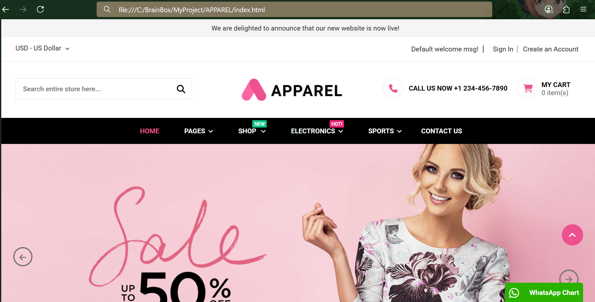

# 👕 ApparelPro - E-commerce Template

ApparelPro is a responsive and stylish front-end e-commerce website template designed for fashion, lifestyle, electronics, furniture, jewelry, auto parts, and more. This template includes a complete homepage layout with various sections including header menus, hero banners, blog posts, testimonials, and footer components.

---

## 📁 Folder Structure
```
APPAREL/
│
├── css/
│ └── style.css
├── accests/
│ ├── logo.png
│ ├── apparelpro-home-banner-1.png
│ ├── More.....
└── index.html
```


---

## 💡 Features

- 🔤 Google Fonts (Roboto)
- 🎨 Modern and clean UI
- 💼 Mega menu navigation
- 🖼️ Hero Banner with slider controls
- 🛒 Cart and Call Icons
- 📢 Advertise Block
- 📰 Recent Blog Posts Section
- 💬 Client Testimonials
- 📱 Sticky WhatsApp Chat Icon
- 📨 Newsletter subscription form
- 📞 Contact Info & Social Media Icons

---

## 🛠️ Technologies Used

- HTML5
- CSS3
- Google Fonts
- Font Awesome CDN (Icons)

---

## 📷 Screenshots


---


---

## 🚀 How to Run

1. Download the full folder (`APPAREL`) with all files and images.
2. Open `index.html` in your preferred web browser.
3. Ensure internet is connected to load:
   - Font Awesome icons via CDN
   - Google Fonts

---

## ⚠️ Notes

- All images are located inside the `/accests/` folder. Make sure paths are correct when opening locally.
- Font Awesome icons and Google Fonts are loaded via CDN and require internet access.
- This is a **static front-end template**, no backend functionality is included.

---

## 📜 License

This template is for educational/demo purposes. You may customize and use it in personal or academic projects.


